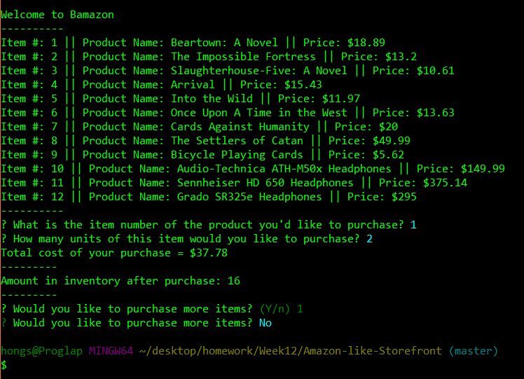

# Amazon-like-Storefront
### Week 12 Assignment - MySQL

### Application Walkthrough

When the program is initated through the command line, the application will display the Bamazon store's inventory.

 

The user will then be prompted to select an item to purchase by typing in the product's item number.

 

The user will then be prompted to type in what quantity of the item they would like to purchase.

 

If there is enough stock to fulfill the customer order, the application will fulfill it and display the customer's total.

 

If there is not enough inventory to fulfill the customer order, the user will be given an error message and be asked to order again.

 

Once the order is complete and fulfilled, the application will then ask if the customer they would like to order more items.

 

If the customer is done shopping, they can type in 'no' or 'n' to signify their request. The application will then exit itself.

 

### Known Bugs

-When the application prompts the customer if they want to shop again, the question is already populated with the number that was used to select the product item number.

-To get past this, the customer can just type their 'yes' or 'no' answer and the application will repopulate the question with their selected answer.

### Bamazon Schema

The table description as well as the data that was placed in.

 

Here is an image depicting the inventory update of item #3 based off of the stock_quantity from the previous image.

 

